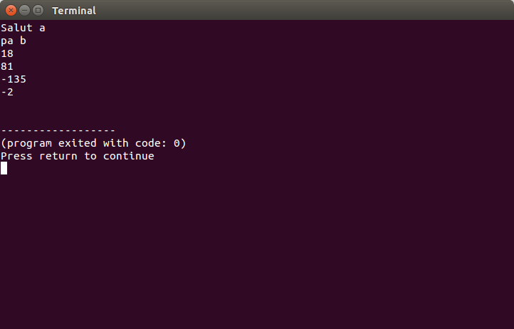

### Acesta este un modul Perl

Dosarul **FooModule** contine doua file:

1.  **Foo.pm**
2.  **useFoo.pl**

In fila **Foo.pm** sunt definite subrutinele Perl, mai jos aveti un exemplu de subrutina:

```perl

    sub scadere {
	   my ($x,$y)=@_;
	   return $x-$y;
    }
```

Fila **useFoo.pl** este fila Perl care utilizeaza subrutinele din fila modul **Foo.pm**. Un exemplu de utilizare al unei subrutine este mai jos:

```perl
    print Foo::scadere(-90,45)."\n";
```

Un exemplu de utilizare il aveti in aceasta imagine:
